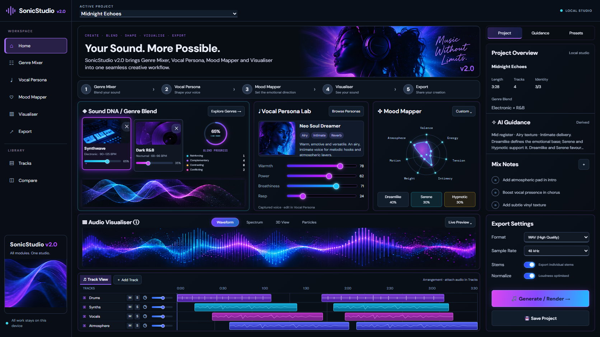

# Two-asset dashboard pilot — 2026-10-06

**Subsequent acceptance:** the user marked this pilot Pass and authorized the remaining 19 references. The completed collection and its latest evidence are recorded in [ASSET_COLLECTION_VERIFICATION.md](ASSET_COLLECTION_VERIFICATION.md). The notes below preserve the original pilot checkpoint.

Scope is exactly two supplied component references: `Images-dashboard/assets/slider_controls.png` and `Images-dashboard/assets/module-card_hover.png`. The other 19 are held for user visual acceptance.

Implementation: `src/dashboardAssetPilot.css`, loaded after existing dashboard layers. Values remain canonical. Home Vocal bars are captured-value summaries; the existing Vocal Persona editor continues to own editing. Source cards retain the actual Genre names and weights.

- Purple gradient tracks, bright bordered handles and halo; Breathiness uses the reference's cyan treatment.
- Hover adds a 5 px lift, violet outline and bloom, 3.5% thumbnail zoom and four softly drifting decorative particles. Fine-pointer hover only.
- Reduced motion disables lift, zoom, particles animation and transitions, retaining static visual feedback.

Checks: Vite production build passes (123 modules); `git diff --check` passes. Production browser at 1672 × 941 reports actual Vocal values 78/62/71/24 before and after hover, violet card border, `translateY(-5px)` and `pilot-card-sparkle`. Reduced-motion reports `transform:none`, `animation:none`, transition `0s`. 390 px scroll width equals viewport width; no page errors. Domain/unit tests were not rerun for this CSS-only change.

Preview: `http://127.0.0.1:5184/`, served from ignored isolated `.ai/review-builds/asset-pilot`. [Default](verification/asset-pilot/default.png), [hover](verification/asset-pilot/card-hover.png), [mobile](verification/asset-pilot/mobile.png).

Status: technically verified, awaiting user visual agreement. Package remains `2.0.0`; no commit/push/deployment. Next step is review or adjustment of these two assets, then expansion only after agreement.
