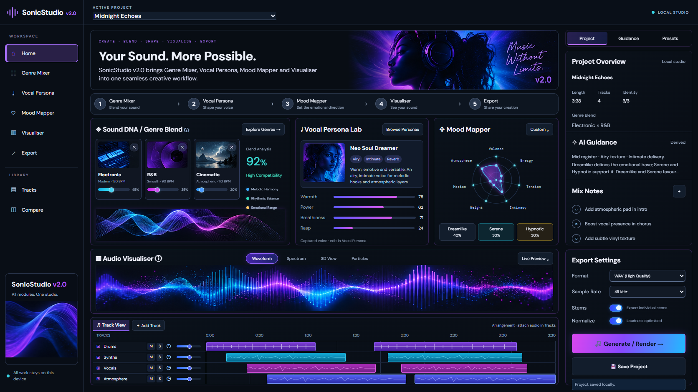

# Fidelity Pass 2 — 2026-10-06

**Superseded presentation evidence:** the user subsequently chose live project values on Home and reference styling only. The current acceptance report and final captures are in [LIVE_FIDELITY_PASS_2_VERIFICATION.md](LIVE_FIDELITY_PASS_2_VERIFICATION.md). This earlier report records the previous illustrative preset build.

Package: `2.0.0`. Local, uncommitted; no push or deployment.

Compared against the supplied original target (`image-1.png`). The second brief mentions Image 3, but no separate Image 3 file was supplied in this chat; the original target contains the requested Sound DNA composition.

## Requirement audit

| Requested element | Production evidence |
| --- | --- |
| Full-width Audio Visualiser | x=216, y=597, width=1122, height=156 |
| Waveform / Spectrum / 3D View / Particles | All four named tabs; one selected at a time; each changes the artwork preview |
| Dual-glow waveform | Supplied reference cyan/violet waveform artwork, independent of live audio |
| Arrangement beneath waveform | y=761–925; Drums, Synths, Vocals, Atmosphere; eight source-referenced clips |
| Three source thumbnails in one row | Electronic / R&B / Cinematic at y=333, each approximately 110 × 146 px, weights 45/35/20 |
| Right-side compatibility block | 92% High Compatibility plus Melodic Harmony / Rhythmic Balance / Emotional Range; no wrapped Sound DNA Captured sources treatment |
| Bottom dual sine-wave preview | Supplied reference artwork, clipped below the thumbnail row |
| Full-height right rail | x=1354, width=304, bottom=925 exactly matches Track View |
| Export Settings | WAV (High Quality), default 48 kHz; Stems and Normalize switches; Generate / Render and Save Project |
| Neon contrast | Measured border `1px solid rgba(168,85,247,.25)`; cyan hover border and purple/cyan box shadows; selected tab and primary gradients |

Raw measured evidence: [layout-audit.json](verification/fidelity-pass-2/layout-audit.json), generated by [layout-audit.js](verification/fidelity-pass-2/layout-audit.js). Card widths are 478.69 / 320.13 / 299.19 px at y=283, matching the reference's wide Sound DNA composition rather than the first pass's equal-column interpretation.

## Checks

- TypeScript build with bundled Node and 256 MB heap: passes.
- Vite production build with the same runtime: passes. Reference display and rail are isolated in `ReferenceStudioModules.tsx` / `ReferenceContextRail.tsx`, with `referencePreset.css` loaded after captured-source chart styles.
- Full suite run sequentially with bundled Node: **253/253 pass**; see [tests.txt](verification/fidelity-pass-2/tests.txt).
- `git diff --check`: passes.
- Style tabs: Spectrum selects its bars; 3D View selects its perspective treatment; Particles creates 90 decorative points; Waveform restores the baseline capture.
- Stems and Normalize both toggle off/on. Sample rate selects 96 kHz and returns to 48 kHz. Defaults restored before screenshot.
- Drums Mute persists across reload and is restored off. Synths Solo toggles on/off. Actions use existing clip fields and storage.
- Generate / Render reports selected WAV settings and the unconnected renderer. Save Project retains the populated dashboard after reload.
- Desktop has zero visible forms and no horizontal overflow. 390/320 px overviews have scroll width equal to viewport width, all source cards and tabs remain present. [390 px capture](verification/fidelity-pass-2/mobile-390.png).
- One audio element and one canvas retained; agent-browser page error report empty.

The first build attempt exhausted machine memory and the connected browser tool transport closed. Stopping this task's unused dev server and using the bundled runtime allowed verification to complete. A fresh agent-browser session with the installed Chrome executable captured an isolated production build at `http://127.0.0.1:5182`, served from ignored `.ai/review-builds/fidelity-pass-2`. Concurrent source/build edits were detected during capture. `ReferenceStudioModules.tsx` owns the reference preset; the separate `FidelityDashboardModules.tsx` captured-source implementation is preserved. A separate preview output avoids shared `dist` rewrites. Blank browser captures are rejected as evidence.

## Semantics and remaining work

The three-source blend and 92% value are explicitly identified as a reference display preset. The card's info control switches to captured Genre sources and computed BlendProgress, preserving the concurrent live-chart workflow; the reference preset is the startup presentation. Wave and additional style visuals are artwork previews; Live Preview opens the real analyzer. WAV controls are interactive request settings, not an implemented audio renderer. The CTA never claims rendering succeeded. Audio files are not supplied by the starter.

This evidence verifies the requested component composition and graphical treatments, not full-image parity or real WAV output. Concurrent BlendProgress/MoodRadar edits were preserved. The 100/100 gate remains open: the live Vocal Persona bars and Mood Mapper graphic still differ from the target. Continue the active fidelity goal before advancing to separately scoped real audio rendering.
