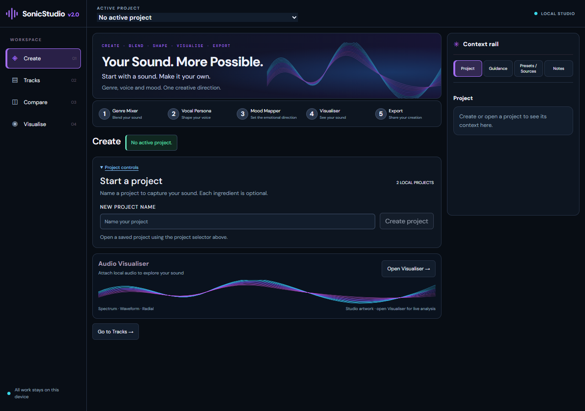

# I-B.1 — Empty-state composition verification

2026-10-06 · Package 2.0.0 · Baseline: clean committed I-B `333ccaebcd560b171c2ffd214701b6a01e49f18f`.

Scope: no active project only. No populated layout or interaction-state redesign, animation, navigation, architecture, schema or handler changes. Empty-project identity with an active project still uses the accepted populated layout.

## Changes

- Added an existing-state presentation marker to the shell; every new CSS selector requires its empty value.
- Compact project onboarding copy and spacing. Native disclosure, name form and create handler retained.
- Hidden the redundant Identity & Brief control on the no-project overview; its tool return action remains available. Removed repeated context/status presentation there, leaving the shell's StatusNotice and project selector.
- Tightened the standalone listening entry artwork/spacing without changing its action. Empty rail retains its existing four sections and truthful empty messages, with 400 px desktop minimum height and 240 px stacked minimum height.

## Results

- `node --test --test-concurrency=1 tests/*.test.mjs`: **251 passed, 0 failed**. No tests modified or added for this presentation-only correction.
- `npm run build`: **PASS**, TypeScript and Vite production bundle.
- `git diff HEAD --check`: **PASS**.
- Initial simultaneous test/build attempt suffered a Node heap allocation failure in build and three failed test subprocesses. Sequential full-suite and build reruns passed. The dev server/browser session was restarted after the resource interruption.
- At 1280 × 900, project card height decreased from 334.5 to 200 px; workflow-next decreased from 245.17 to 189.17 px. Final content bottom is 744.22 px with the explicit no-project status, versus 981.77 px before. Empty rail increased from 215.19 to 400 px.
- Populated Create after reload exactly matched sampled pre-edit geometry: hero `(202,72,749,144)`, stepper `(202,246,749,60)`, identity `(202,351.59375,749,616.078125)`, module grid `(202,373.59375,749,316.890625)`, rail `(963,72,290,519.984375)`. Opening a project adds its existing status and therefore shifts following content; reload normalizes that existing message difference.
- Empty overview at 1280/390/320 px: no page horizontal overflow, no visible orphaned Identity & Brief button; rail heights 400/240/248.19 px. Existing narrow workflow strip remains internally scrollable.
- Name input enabled Create when named; clearing it disabled Create. Tab to enabled Create retained the I-B 2 px cyan-white focus ring. No project was created or deleted.
- Saved populated project opened and persisted through reload; switching back restored onboarding. All four rail sections showed their established empty messages. Console warning/error logs empty on final review.
- Opening Genre Mixer without a project retained the existing visible Identity & Brief return button. Returning to overview hid its redundant treatment again.

## Evidence and limits

`verification/phase-ib1/before.png`, `after-desktop.png` and `after-narrow.png` are raw CDP PNG captures; desktop 1280 × 900 and narrow 390 × 900. The separate earlier I-B enlarged-capture softness investigation remains documented in IB_VERIFICATION.md; this correction does not modify image generation or capture infrastructure.

[Before correction](verification/phase-ib1/before.png) · [Narrow composition](verification/phase-ib1/after-narrow.png)

Browser review used no active project with two existing saved projects. A fresh zero-record storage reset was not performed; the same no-active-project branch handles that state, and its displayed count remains derived from the existing store. Existing project contents and libraries were not edited. No new creation/deletion, audio or export flows were introduced or re-audited. Prior I-A/I-B functional evidence remains the broader regression record.

Gate: local narrow correction verified; user visual acceptance remains separate. I-C and I-D remain unstarted; no commit, push or deployment.

Checkpoint authorization: user approved commit and push with the image as evidence on 2026-10-06. The implementation, verification notes and three screenshots are included in that checkpoint. I-C/I-D and deployment remain outside this authorization.
