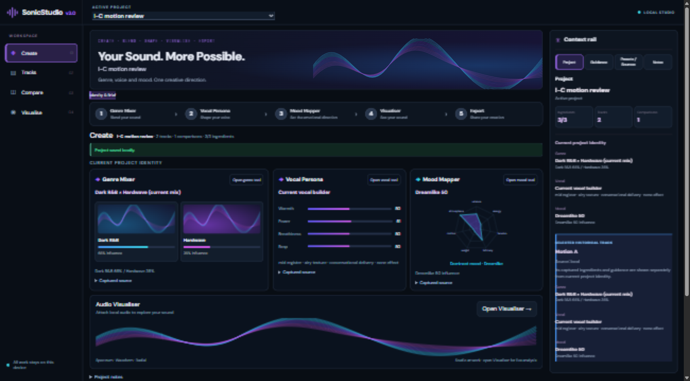
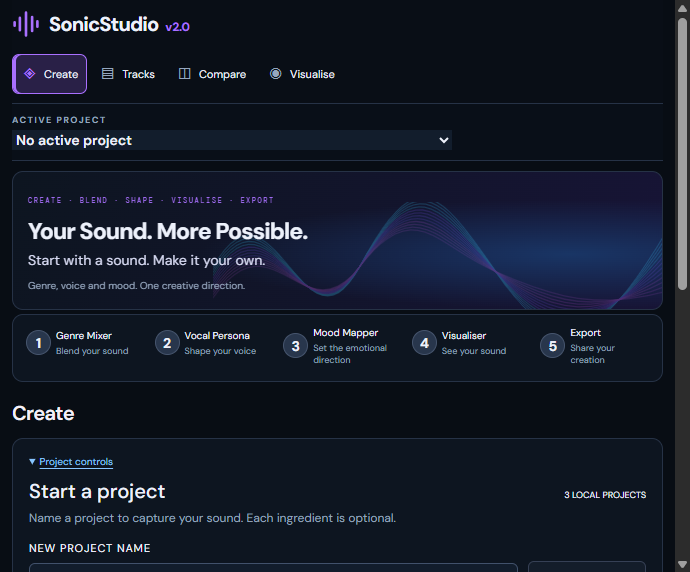

# Phase I-C — Motion System verification

2026-10-06 (Europe/London) · Package 2.0.0 · Local implementation gate PASS within the stated browser coverage. User visual acceptance remains separate. Full Phase I incomplete; I-D unstarted. No commit, push or deployment.

## Baseline and scope

Clean `git status --short`; actual HEAD `9ac4429cd2745717155284fc728180ff6b52c9cb`, matching the supplied accepted baseline. Read SOUL/AGENTS, PROJECT/CHANGELOG/DECISIONS/ROADMAP, I-A/I-B/I-B.1 handoffs and verification records. Accepted UI takes precedence over the supplied two motion boards; no aspirational functionality added.

Protected: I-A/I-B/I-B.1 geometry/endpoints, four destinations/five steps, domain ownership/persistence, historical/current distinction, single media/analyser/Visualiser RAF, Timeline clocks and shortcut semantics. Working area: final CSS motion layer and two presentation keys. No animation library/global state/dependency/version change.

## Motion inventory

| Surface | Implementation / meaning |
| --- | --- |
| Tokens | Fast 140 ms, base 210 ms, slow 320 ms, emphasis 520 ms; standard cubic-bezier(.2,.8,.2,1), out (.16,1,.3,1), in (.4,0,1,1). Slow/in are reserved vocabulary. |
| Sidebar / workflow | Existing fill/border/glow/color endpoints interpolate; sidebar icon scales 1.03 on fine-pointer hover. Active numbered marker transitions its existing fill/glow. Press is immediate, no continuous step pulse. |
| Buttons | Shared 140 ms state-color/border/shadow and 210 ms transform grammar. Real primary actions scale 1.015 on hover, press .99; quiet controls have no hover lift. Destructive confirmations have no scale/playful effect. Gradient endpoints remain I-B's actual gradients without a new sweep. |
| Genre / Vocal / Mood cards | Consistent -2 px hover lift, existing border interpolation. Focus within holds cards still. Artwork remains static outside the hero. |
| Sliders / inputs | Native semantics retained; range thumb scale 1.08 on fine-pointer hover. Numeric values, fill extent and seeking remain immediate; colors/borders interpolate. Focus/thumb focus remains immediate. |
| Hero | Only existing decorative vector translates horizontally from 0 to -8 px over 12 seconds, alternating slowly. No opacity change/large zoom/new particles; other waves stay static. |
| Workspace / historical | Short entry from opacity .92 and translateY(4 px). No exit system or duplicated mounted editor. Historical notices retain explicit captured-value/Use messaging. |
| Context Rail | Existing keyed section enters with the same short 4 px fade; buttons use shared state grammar. No new section/draft owner. Parent track-note draft survives section switching. |
| Timeline | Clip hover/selection/mute/solo/control transitions use I-B endpoints. Playhead border/glow interpolate; `left` never does. No new waveform/playhead smoothing or multi-track implication. |
| Compare | Existing A/B selection, playback, preference and draft/saved endpoints interpolate without a new winner or auto-switch. |
| Visualiser | Mode/playback/personality control and panel entry only. Canvas renderer/audio graph/RAF lifecycle unchanged; no canvas-mode interpolation. |
| Export / status | Shared notices enter with opacity .85/2 px. Existing successful copy/requested-download feedback adds one 520 ms small success glow. Errors get restrained notice entry only. No fake rendering/loading or auto-dismiss. |

Files: `src/motion.css`, `src/main.tsx`, `src/ContextRail.tsx`, `src/ExportPanel.tsx`; PROJECT, CHANGELOG, DECISIONS, this report, I-C handoff and the evidence folder. Context Rail key follows its existing section; Export key follows its existing operation ref. No new JS state/effect/loop/listener; no CSS-only unit tests added. React checklist review retained existing hook/owner/accessibility behavior and avoided unrelated refactoring.

## Automated verification

- `npm test`: **251 pass, 0 fail, 0 skipped**, unchanged suite. Test duration reported 10031 ms.
- `npm run build`: **PASS**, TypeScript/Vite production build; rerun after final CSS precedence correction.
- `git diff --check`: **PASS**, final documentation/evidence included. LF/CRLF informational warnings are not whitespace failures.
- Source review: no new RAF/setInterval/timeout, dependencies, state store or renderer/analysis/Timeline handler changes. Existing Visualiser RAF source is untouched. No width/height/top/left/filter interpolation or will-change promotion.

## Desktop browser observations

Local Vite development StrictMode in the in-app browser, 1664 × 920 CSS pixels. CLI agent-browser was unavailable, so the documented browser/CDP interface supplied interaction, emulation, computed-style and screenshot evidence. Created only a dedicated `I-C motion review` project; prior projects and source libraries untouched. Review stores Genre 65/35 Dark R&B/Hardwave, airy Vocal with Power 51, Dreamlike Mood, two immutable snapshot/duplicate tracks, one A/B comparison and test notes. Reused the committed 12-second interaction-tone.wav. Reload clears session audio; metadata stays.

- Exact before/after baseline geometry on the same pre-existing empty-ingredient project: sidebar `(0,0,200,920)`; hero `(216,72,1093,144)`; workflow `(216,246,1093,58)`; module grid `(216,371.59375,1093,266)`; rail `(1325,72,310,596.796875)`. No motion layout changes. [Baseline samples](verification/phase-ic/baseline-geometry.json).
- Genre hover sampled intermediate transform Y -1.62356 px and settled -2 px. Primary hover sampled scale 1.01019 on its way to 1.015. No overflow or adjacent reflow observed. Card child focus stops lift. Focused Genre range ArrowRight changed 60→65; Vocal Power changed 50→51. Keyboard outline computed RGB 180/245/255 solid 2 px with transition 0s and transform none.
- Sidebar destinations and all workflow tools retain immediate native navigation/focus. After short entrances settle, resting Create has exactly `studio-hero-flow`; one later sample measured X -7.97327 px. Tools/listening destinations have no hero and no continuing decorative animation. All sampled hidden descendants have zero live CSS animations.
- Rail Project/Guidance/Sources/Notes section flows remain readable. Project notes persist; a selected-track draft typed into Notes survives Guidance→Notes and saves. No automatic focus movement from the keyed entry.
- Snapshot Alt+Shift+S focuses title; capture Motion A and explicit duplicate Motion B keep captured identity and require separate audio. Alt+Shift+C seeds Compare outside fields. Historical Genre reopening displays Motion A's exact 65% and explicit Use/Replace boundary. Current project ingredients stay unchanged; editor adjustment can remain a separate draft.
- Timeline clip selection, mute/unmute, solo/unsolo and real playback exercised. Audio time advances; playing state true. Playhead computed transition properties are only `border-color, box-shadow`, so CSS adds no positional lag. An example sample was media 8.155 seconds vs existing playhead state 7.7; existing clock publication cadence was not changed or represented as frame-synchronous precision.
- Compare saves B preference/conclusion while playback can select A, switches A↔B, pauses and opens B in Visualise. Duplicate B initially remains unavailable until reattachment; handoff focuses the correct file input. No preference follows playback automatically.
- Visualiser Waveform through Space, Radial through Enter, Classic personality selection and real Play/Pause passed. Across Timeline/Compare/Visualise: one HTML audio element, one canvas, `data-graph-creations=1`. Source diff confirms the sole Visualiser RAF owner unchanged; no fresh allocation/RAF instrumentation was installed.
- Export copy reports actual clipboard success; feedback computed `studio-notice, studio-success`. Download reports `Download requested`, never saved/rendered. Temporarily rejecting clipboard.writeText gives the existing alert/recovery text with only `studio-notice`; temporarily throwing URL.createObjectURL gives `Download could not start`. Both injected functions restored. Actual downloaded-file saving is not established by this review.
- Reload preserves two track records, one comparison, ingredients, preference/conclusion and notes. It restores `NO AUDIO`/reattachment messaging. Keyboard focus is visible and outside hidden surfaces. Final console warn/error logs: **empty**; selector timeouts in automation were not app console failures.

## Reduced motion, hover and narrow checks

Emulated `prefers-reduced-motion: reduce`: hero animation none; `document.getAnimations()` zero after navigation/interactions. Repeated Genre keyboard changes, Timeline Play/Pause, Compare B Play/Pause, Visualiser mode/Play/Pause, Export copy and rail changes. Feedback remains textually/visually present; focused notes retain immediate 2 px ring, 0s transition, outside hidden views. Existing signal motion policy remains the untouched Visualiser's responsibility.

48 populated checks: eight surfaces (four destinations plus Genre/Vocal/Mood/Export) × 1280/390/320 × normal/reduced motion. Every check has scroll width equal to client width and zero hidden animations. [Raw results](verification/phase-ic/responsive-smoke.json). Six no-project checks across both settings also pass: [reduced](verification/phase-ic/empty-smoke.json), [normal](verification/phase-ic/empty-normal-smoke.json). Internal stepper/Timeline scrolling remains native; no I-D breakpoint redesign.

Coarse-pointer emulation reports `(hover:hover)=false`, `(pointer:fine)=false`, `(pointer:coarse)=true`; module transform is none and keyboard activation still works. Native touch dispatch is unsupported in this browser, and mouse-to-touch dispatch stalled; emulation was restored. This verifies media-gated presentation, not physical touch gestures/device behavior. Media/viewport overrides are reset at completion.

## Evidence, performance and limits

[390 px Create](verification/phase-ic/create-390.png) · [Reduced-motion desktop](verification/phase-ic/create-reduced-desktop.png).

Motion evidence comes from the timed transform/animation/computed-style observations above; static screenshots alone cannot prove motion. No recording or large media added. Some full-page captures show the existing browser capture softness already recorded in I-B, especially surfaces without an active transform; screenshots support composition rather than text raster-quality claims.

Observed no motion-induced layout shifts, page overflow, jank, hidden continuous effects or continuing decorative motion after leaving Create. Only one low-intensity hero effect runs at rest; all other animations are short one-shot entries/feedback. This is interaction/source verification, not a long-session CPU/GPU benchmark or device/codec/complete accessibility audit. No simulated playback telemetry or fake loading/render state is introduced.

Deferred: exit choreography, sweeps/ripples, particles, numeric counting, radar breathing, canvas blending and additional continuous decoration. Keeping these absent preserves workstation restraint and ownership. PROJECT/CHANGELOG/DECISIONS updated after verification; ROADMAP direction unchanged. Next: user motion review, then separately authorized I-D. Do not mark full Phase I complete or commit/push/deploy implicitly.

## Follow-up — blurry in-app preview (2026-10-06)

User reported renewed blur. A fresh native-size 690 × 572 preview rendered sharp with hero motion enabled. Enlarging the in-app viewport to 1664 × 920 reproduced broad text softness even with reduced motion, zero active animations, DPR 1, and no shell/sidebar/workspace/rail transforms or filters. Resetting the viewport override and reloading restored sharp text with hero motion enabled. This isolates the observed softness to the enlarged in-app preview rendering path; the underlying browser/app scaling mechanism remains unresolved. No product CSS was changed. Native-size preview left open; all temporary overrides cleared. Use native-size evidence for raster-quality review and retain enlarged-view geometry checks as separate evidence.

