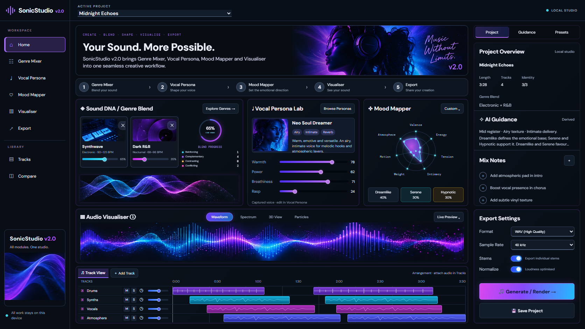

# Fidelity Pass 2 — live project styling acceptance, 2026-10-06

Package remains `2.0.0`. Local changes only; no commit, push or deployment.

The user resolved the conflicting Home scopes: **“Live project values on Home; match reference styling only.”** This supersedes the illustrative three-source/92% preset and reference chart labels. Source count and chart values follow the actual project model. The original target remains the specification for composition, density, neon treatment and lower sections.

## Requirement audit

| Requirement | Current evidence |
| --- | --- |
| Active project without empty/setup form | Midnight Echoes; zero visible forms |
| Three middle studio cards | Sound DNA / Vocal Persona Lab / Mood Mapper; y=283, height=306; widths approximately 479/320/299 px |
| Sound DNA composition | Two actual source thumbnails on one row, weights 65/35, right-side calculated BlendProgress and relationship counts, bottom dual sine preview |
| Live values | Synthwave / Dark R&B; 65% lead share; 1 reinforcing, 4 complementary, 0 contrasting, 2 conflicting; four captured Vocal values and all seven Mood DNA dimensions |
| Full-width Audio Visualiser | y=597–753; Waveform / Spectrum / 3D View / Particles; supplied cyan/violet dual waveform artwork |
| Arrangement beneath visualiser | y=761–925; Drums, Synths, Vocals, Atmosphere; eight persisted clips |
| Persistent full-height context rail | Project Info, derived Guidance, Mix Notes and Export Settings together; rail baseline exactly y=925 |
| WAV settings/actions | WAV, 48 kHz, Stems / Normalize switches, gradient Generate / Render and Save Project |
| Borders and glow | Base border `1px solid rgba(168,85,247,.25)`; cyan/purple hover and keyboard focus glow; selected mode gradient `#7135ff → #176cbd` |
| Dense reference styling with live charts | Thumbnail framing, Vocal meter handles, filled cyan/violet Mood Radar and reference wave artwork; no mock chart values introduced |

Measured evidence: [live-layout-audit.json](verification/fidelity-pass-2/live-layout-audit.json), produced by [live-layout-audit.js](verification/fidelity-pass-2/live-layout-audit.js). Preview: `http://127.0.0.1:5183/`, isolated output `.ai/review-builds/fidelity-pass-2-live`.

## Verification

- TypeScript compilation and Vite production build pass (122 modules).
- Fresh full test run: **253 passed, zero failed**. [Test output](verification/fidelity-pass-2/live-tests.txt).
- `git diff --check` passes.
- All four preview tabs change mode; Particles renders 90 decorative points; Waveform restored for capture.
- Stems and Normalize toggle off/on; sample rate changes to 96 kHz and returns to 48 kHz.
- Generate / Render reports the selected settings and explicitly states rendering is unconnected.
- Save/reload retains Midnight Echoes; Drums mute persists across reload and is restored off.
- 390 and 320 px have no horizontal overflow; all three modules remain present. [390 px screenshot](verification/fidelity-pass-2/live-mobile-390.png).
- One audio element retained; browser error report empty.

The revised styling milestone is accepted by current implementation and verification evidence. Real WAV rendering, playable starter audio and broader Phase I work remain separate future milestones. No full-image pixel-equality claim applies after the user's live-data choice.
