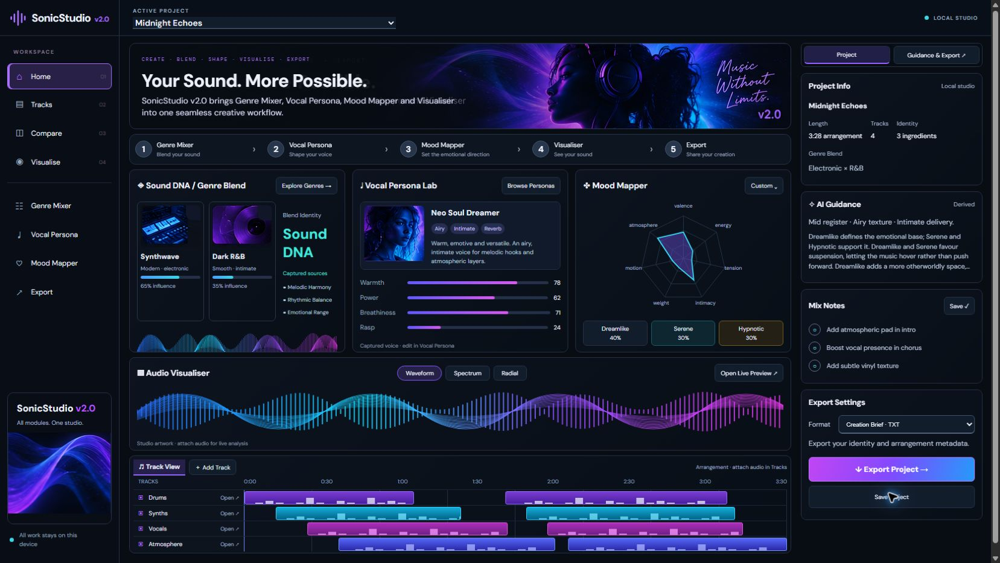

# Target Parity layout verification — 2026-10-06

Package remains `2.0.0`. Layout/state work is local and uncommitted; no push or deployment.

## Required desktop capture

Production build served at `http://127.0.0.1:5181`, reviewed in Chrome at the supplied target's 1672 × 941 dimensions. Temporary viewport overrides were reset after verification.

Measured DOM geometry is recorded in [geometry.json](verification/target-parity/geometry.json). Main workspace display is CSS Grid; module columns are exactly `361px 361px 361px`. Sound DNA, Vocal Persona Lab and Mood Mapper are all 306 px high at y=283. The reference's module row begins around y=282 and ends around y=588. Our equal-width requirement intentionally differs from the reference's wider Sound DNA card.

The full-width Visualiser band begins at y=597 and ends at y=753; reference approximately y=600–753. The full-width Track View begins at y=761 and ends at y=925; reference approximately y=763–924. Four visible lanes and eight persisted clips reproduce the lower arrangement density. The 304 px right rail includes all four requested context sections and ends at y=869. Hero artwork, creative cards, voice meters, Mood fingerprint, wave band, colored arrangement and export action were visually inspected after styling corrections.

Zero visible forms, no visible No active project or Start a project treatment, no horizontal page overflow. Startup is Midnight Echoes. One audio element and one canvas remain mounted.

## Functional and regression evidence

- `npm test`: 253/253 pass. Two new starter tests verify canonical storage roundtrip, valid clip references, absent audio files and independent captured histories.
- `npm run build`: TypeScript and Vite pass.
- `git diff --check`: pass.
- Production-browser Genre and Mood card actions, Vocal card action, clip-to-Timeline handoff, Home return and Live Preview handoff verified. A browser mouse-dispatch timeout occurred after a Home click; fresh DOM inspection confirmed the navigation succeeded.
- Save Project and reload retain four tracks/eight clips and reopen the populated dashboard. Save feedback comes from the project owner's real storage result.
- 390 × 844 and 320 × 800 overview checks show no horizontal overflow and all three modules remain present. [390 px full-page capture](verification/target-parity/dashboard-390.jpg). Only overview responsiveness is covered by this pass.
- Final captured warning/error console logs empty.

Agent-browser could not establish its daemon connection and the in-app browser could not attach; verification used the connected Chrome browser. Screenshot files were captured from the production page, not assembled from the reference.

## Practical limits and next gate

This is the requested active-state/layout density pass, not exact pixel or feature parity. Actual native source data remains two Genre sources, four Voice dimensions and seven Mood axes. Reference UI artwork supplies decoration only; wave artwork and clip symbols are not analyzed signal. Starter audio is not attached, so real playback requires local files. Export offers the existing TXT brief/JSON package, not WAV, stems or rendering.

Live audio playback, export file saving, all editor breakpoints, long-session performance, native touch and exhaustive accessibility were not rerun here. Existing records and media implementations remain authoritative. Recommended next gate: user visual review, followed by a separately scoped detail/accessibility pass.
